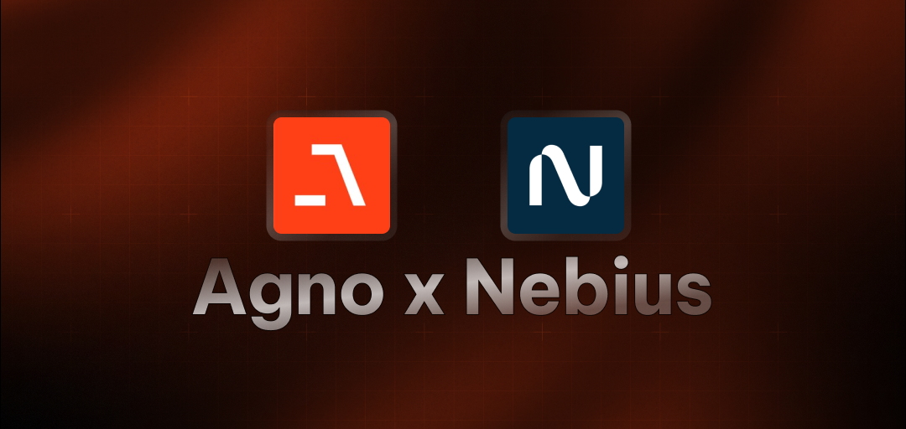

# Agno Agents




This folder has the following agents:

- [web search agent](#web-search-agent)
- [multi agent system](#multi-agent-system)
- [knowledgebase agent](#knowledgebase-agent)


## Tech Stack

- Agno framework for AI agent development
- Nebius AI's for running LLMs
- Duckduckgo for web search
- Yahoo Finance for finance data
- Couchbase as vector storage

## Prerequisites

- Python 3.10 or higher
- Nebius API key (get it from [Nebius AI Studio](https://studio.nebius.ai/))
- Couchbase database credentials (for couchbase example)

## Installation

**1. Get the code**

```bash
git   clone    https://github.com/nebius/ai-studio-cookbook/
cd    agents/agno-agents-examples
```

**2. Install dependencies:**

using `uv`

```bash
# create a venv and install dependencies
uv  sync

# install a kernel
source  .venv/bin/activate
python -m ipykernel install --user --name="cookbook-1" --display-name "cookbook-1"
# select this kernel in Jupyter
```

Or install using python pip

```bash
pip install -r requirements.txt
python -m ipykernel install --user --name="cookbook-1" --display-name "cookbook-1"
# select this kernel in Jupyter
```

**3 - Create .env file**

Create a `.env` file in the project root and add your Nebius API key:

```bash
cp env.example .env
```

```
NEBIUS_API_KEY=your_api_key_here
```

## Running the agents

**Using uv**

```bash
uv run --with jupyter jupyter lab
```

**using python/pip**

```bash
jupyter lab
```

Open the notebooks in Jupyter
- select the kernel we defined earlier
- run the notebook

## Agents

### Web search agent

Uses duckduckgo to search the web

[agno_websearch_agent.ipynb](agno_websearch_agent.ipynb)

2. Creating an agent with a knowledge base for specialized domains
3. Building multi-agent systems where specialized agents work together

### Multi Agent System

This example shows how mutiple agents work togethe.

1. A web search agent for finding general information
2. A finance agent for retrieving financial data
3. A coordinator agent that delegates tasks to the specialized agents

[agno_multi_agent.ipynb](agno_multi_agent.ipynb)

### Knowledgebase Agent

This example demonstrates how to create an agent with specialized knowledge.   Use couchbase as vector database.

**Prerequisites**

- We need to connect to a couchbase instance.  You can sign up for a free account at [www.couchbase.com](https://www.couchbase.com/)
- Also add the following attributes to `.env` file

```text
COUCHBASE_USER=username
COUCHBASE_PASSWORD=password
COUCHBASE_CONNECTION_STRING=
```
[agno_knowledgebase_agent.ipynb](agno_knowledgebase_agent.ipynb)


## References and Acknowledgements

- [Agno Framework](https://www.agno.com/)
- [Nebius AI](https://studio.nebius.ai/)
- Contributed from [awesome-ai-apps](https://github.com/Arindam200/awesome-ai-apps)